# Unity GPU Instancing
运行环境：Unity 2018.3.2f1


Unity 提供了**Static Batching**和**Dynamic Batching**两种方式来优化渲染性能。

* **Static Batching**

  **Static Batching**会在Build阶段提取多个使用相同材质的，且不会移动，旋转和缩放模型的**Vertex buffer**和**Index buffer**。然后将顶点数据变换到世界空间下，存储到最终**Static Batching**所使用的**Vertex buffer**中，并记录每个子模型的**Index buffer**在**Static Batching**所使用的**Index buffer**中的位置。在绘制阶段，会一次性提交合并后的模型顶点数据，最终引擎会根据子模型的可见性确定需要绘制的子模型，设置一次渲染状态，再调用多次**Draw Call**分别绘制子模型。

  所以**Static Batching**并没有减少**Draw Call**的数量，但在绘制阶段避免了多次数据提交和渲染状态的切换。

* **Dynamic Batching**

  **Dynamic Batching**会在运行时将使用同一材质的模型进行合并渲染，也就是将符合条件的GameObject放在一个**Draw Call**中绘制。使用**Dynamic Batching**有一些限制：

  1. 模型最高900个顶点属性，300个顶点。假如我们的Shader中每个顶点使用了Position, Normal, UV,那么模型只能有300个顶点。如果在Shader中使用了Position, Normal, UV0, UV1, Tangent,那么顶点数就要减少到180个（5*180=900）。
  2. GameObject之间有镜像变换的不能进行合批
  3. 使用Multi-pass Shader的GameObject禁止合批
  4. 拥有lightmap的对象，无法合批
  5. GameObject接收实时阴影无法合批

  **Dynamic Batching**在降低Draw Call的同时会导致额外的CPU性能消耗，所以仅在合批操作的性能消耗小于不合批，**Dynamic Batching**才有意义。

#### 1.1 动态合批

1. 新建一个球体的Prefab用于测试

   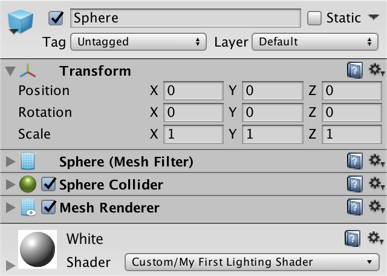

2. 新建**GPUInstancing**脚本，用于生成Sphere实例

   ```c#
   using System.Collections;
   using System.Collections.Generic;
   using UnityEngine;
   
   public class GPUInstancing : MonoBehaviour 
   {
   
       public Transform prefab;
   
       public int instances = 5000;
   
       public float radius = 50f;
   
       void Start()
       {
           for (int i = 0; i < instances; i++)
           {
               Transform t = Instantiate(prefab);
               t.localPosition = Random.insideUnitSphere * radius;
               t.SetParent(transform);
           }
       }
   }
   
   ```

3. 新建**GameObject**并添加脚本**GPUInstancing**，生成半径50，实例数5000。

   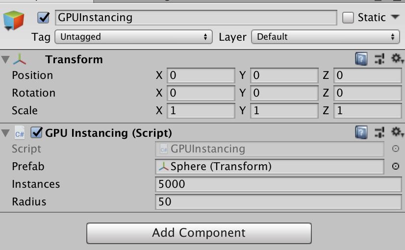

4. 将相机位置设置在（0，0，-100）以保证所有物体均在视野范围内。关掉光源的**Shadow**，设置相机的渲染路径为**Forward Rendering**。

   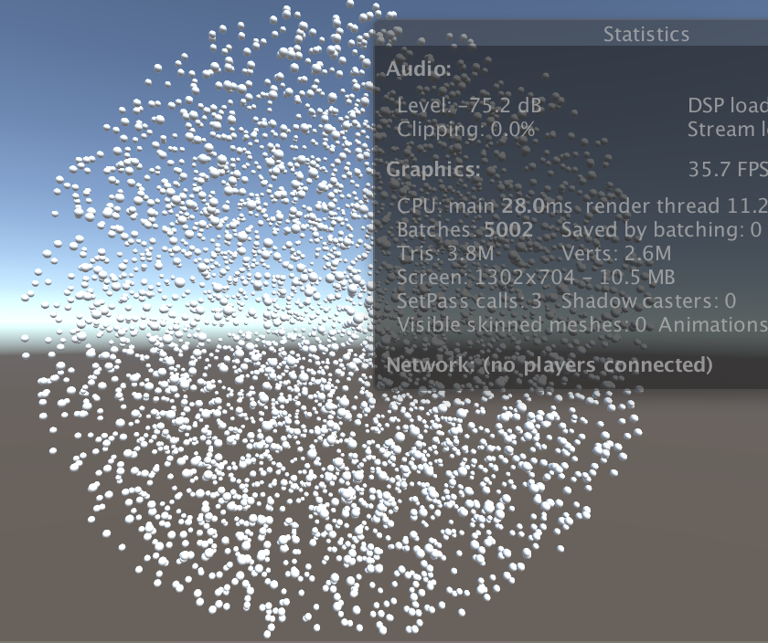

   可以看到总共有5002次DrawCall(Batches),其中5000次是场景中的球体的绘制。尽管开启了动态合批，但由于Sphere的模型过大，导致无法动态合批。而且FPS只有0.6

5. 将Sphere替换为Cube，观察合批结果

   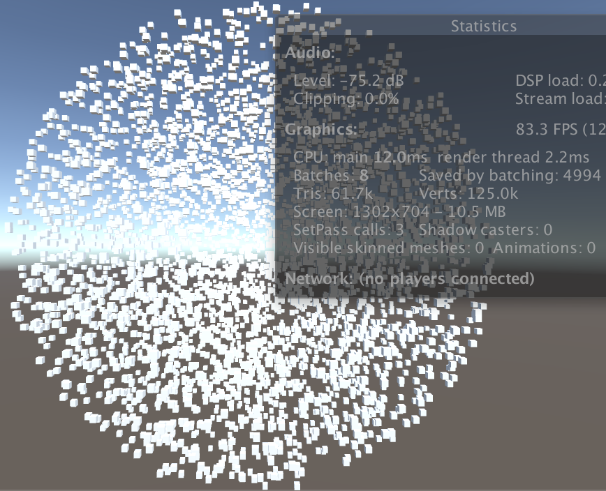

   可以看到这时只有8次DrawCall(Batches)，4994个Cube被动态合批了。FPS也从0.6fps上升到了75fps。

#### 1.2 GPU Instancing 测试

​	GPU Instancing 并不是默认开启的。Shader需要特殊处理才能支持GPU Instancing。Unity的standard shader中是有开启GPU Instancing选项的，如果是自定义Shader，就需要自己去处理。我们先来用Sphere的渲染来测试下，5000个Sphere不开启GUP Instancing的情况：

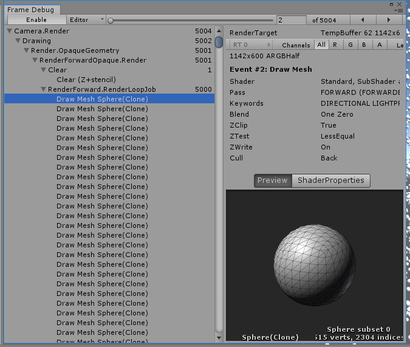

因Sphere无法动态合批，5000个Sphere就5000次DrawCall。

现在把材质中的**Enable GPU Instancing**选项开启：

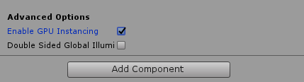

再次运行程序：

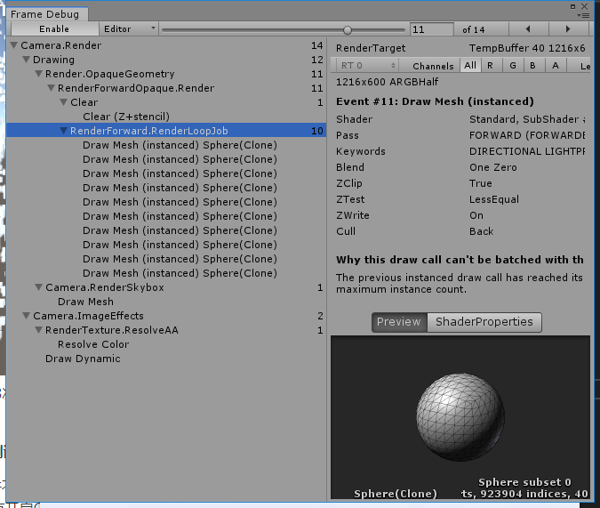

5000个Sphere被合批至10个DrawCall中处理了。被Instancing的Draw Call都被标记为了Draw Mesh(instanced)了。

#### 1.3 什么是GPU Instancing

GPU Instancing是指由GPU和图形API支持的，用一个DrawCall同时绘制多个具有相同网格物体的技术。假如现在有一个包含大量模型的场景，而这些模型的网格数据都一样，不同的仅仅是世界空间下坐标不同。如果按照正常的渲染流程，DrawCall次数是和物件数量相同的，随着物件数量的上升CPU往GPU上传的数据就会越来越多，很快就会遇到性能的瓶颈。

使用GPU Instancing技术时，数据的上传是一次性打包上传至GPU的，紧接着调用GPU和图形的API利用这些数据绘制多个物件。Unity中的具体实现步骤如下：

* 将Per-Instance Data(世界矩阵，颜色等自定义变量)打包成Uniform Array，存储在Instance Constant Buffers中
* 对于可以使用Instancing的Batch，调用各平台图形API的Instancing DrawCall，为每个Instance生成一个不同的SV_InstanceID
* 在Shader中使用SV_InstanceID作为Uniform Array的索引来获取当前Instance的Per-Instance Data

GPU Instancing技术并不是总能提高性能的，如果场景中有大量使用相同材质和相同网格的物体并性能问题是由DrawCall次数过多导致的，这时使用GPU Instancing可以得到不错的性能提升。在实际的游戏项目中植被和树木是最适合使用的。这里要注意的是GPU Instancing是通过减少DrawCall来降低CPU开销的，但这同事也会为GPU带来额外的开销。**适合的才是最好的，切勿沉迷性能优化无法自拔**。

目前GPU Instancing支持的平台：

* DirectX11 and DirectX12 on Windows
* OpenGL Core 4.1+/ES3.0+ on Windows, macOS, Linux, iOS and Android
* Metal on macOS and iOS
* Vulkan on Windows, Linux and Android
* PlayStation 4 and Xbox One
* WebGL(requires WebGL 2.0 API)

使用GPU Instancing 技术注意事项：

* 使用Lightmap的物体无法使用Instancing
* 受不同Light Probe / Reflection Probe影响的物体无法使用Instancing
* 使用包含多个Pass的Shader物体，只有第一个Pass可以Instancing
* 前向渲染时，受多个光源影响的物体只有Base Pass可以Instancing, Add Passes不行
* Instancing 适用于MeshRenderer组件和Graphics.DrawMesh()
* 需要物件使用相同的Material和Mesh
* 需要把Shader改成Instanced的版本
* 当所有条件均满足的情况下，Instancing是自动进行的，并且优先级高于 Static/Dynamic Batching

#### 2.1 让自定义Shader支持Instancing

首先我们新建一个简单的Shader：

```c#
Shader "Copper/LightingShader"
{
	Properties
	{
		_MainTex ("Texture", 2D) = "white" {}
	}
	SubShader
	{
		Tags { "RenderType"="Opaque" }
		LOD 100

		Pass
		{
			CGPROGRAM
			#pragma vertex vert
			#pragma fragment frag
			// make fog work
			#pragma multi_compile_fog
						
			#include "UnityCG.cginc"

			struct appdata
			{
				float4 vertex : POSITION;
				float2 uv : TEXCOORD0;
			};

			struct v2f
			{
				float2 uv : TEXCOORD0;
				UNITY_FOG_COORDS(1)
				float4 vertex : SV_POSITION;
			};

			sampler2D _MainTex;
			float4 _MainTex_ST;
			
			v2f vert (appdata v)
			{
				v2f o;
				o.vertex = UnityObjectToClipPos(v.vertex);
				o.uv = TRANSFORM_TEX(v.uv, _MainTex);
				UNITY_TRANSFER_FOG(o,o.vertex);
				return o;
			}
			
			fixed4 frag (v2f i) : SV_Target
			{
				// sample the texture
				fixed4 col = tex2D(_MainTex, i.uv);
				// apply fog
				UNITY_APPLY_FOG(i.fogCoord, col);
				return col;
			}
			ENDCG
		}
	}
}
```

接下来我们需要添加Instancing开启的编译指令：

```c#
#pragma vertex vert
#pragma fragment frag
// make fog work
#pragma multi_compile_fog
// 开启 Instancing支持
#pragma multi_compile_instancing
```

然后在Shader的Inspector中就会出现 **Enable GPU Instancing** 的选项：

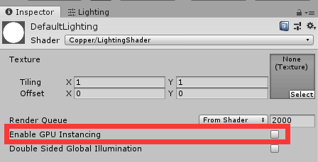

勾选开启GPU Instancing后，运行程序后会得到一下结果：

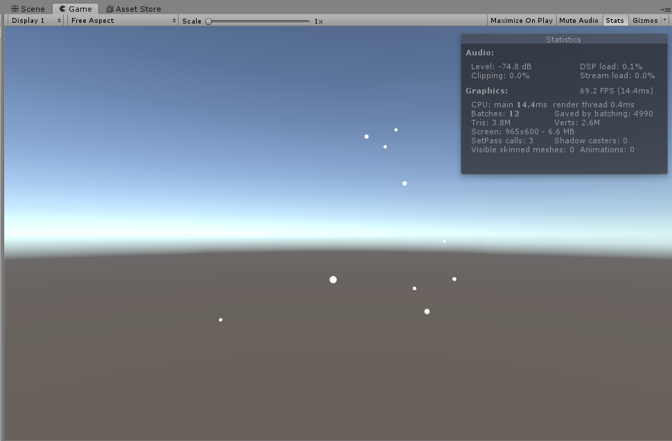

观察Stats发现渲染处理了5000个Sphere，最终合批为10次DrawCall。但我们却只在场景中观察到了10个Sphere。为什么5000个Sphere在渲染，而场景中只有10个Sphere？

#### 2.2 UNITY_VERTEX_INPUT_INSTANCE_ID

上面的例子中5000个Sphere渲染，而只在场景中看到10个Sphere是因为GPU在处理Instancing的时候如果没有为每个Instancing指定唯一的**Instance_id**，那么GPU就会默认使用第一个。所以同一批次的Sphere都会出现在同一位置。我们修改一下Shader再来测试：

```C#
struct appdata
{
    UNITY_VERTEX_INPUT_INSTANCE_ID
    float4 vertex : POSITION;
    float2 uv : TEXCOORD0;
};

v2f vert (appdata v)
{
    v2f o;
    UNITY_SETUP_INSTANCE_ID(v)
    o.vertex = UnityObjectToClipPos(v.vertex);
    o.uv = TRANSFORM_TEX(v.uv, _MainTex);
    UNITY_TRANSFER_FOG(o,o.vertex);
    return o;
}
```

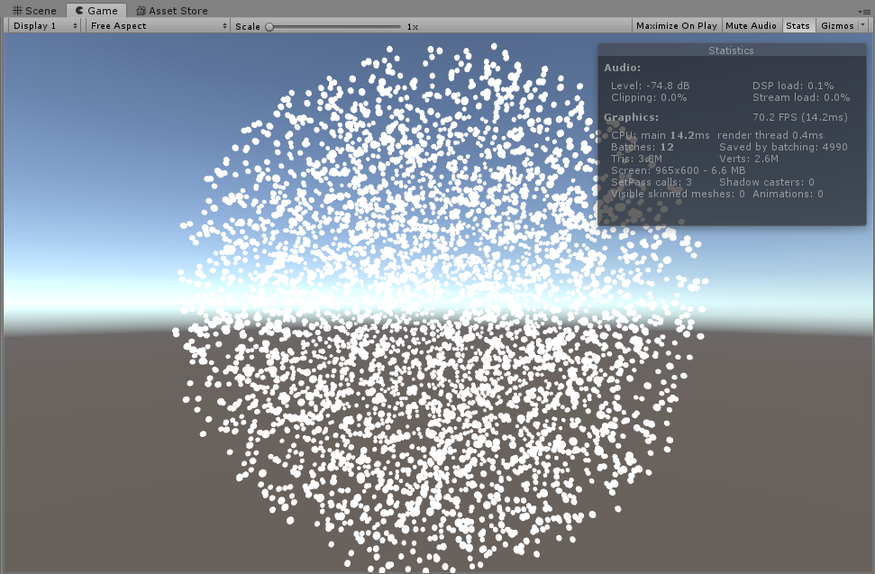

修改Shader后渲染结果恢复正常。下面我们来理解一下`UNITY_VERTEX_INPUT_INSTANCE_ID`和`UNITY_SETUP_INSTANCE_ID`。

Unity中Instancing相关的指令都定义在`Unity安装目录\Editor\Data\CGIncludes\UnityInstancing.cgine`文件中。

```c#
////////////////////////////////////////////////////////
// basic instancing setups
- UNITY_VERTEX_INPUT_INSTANCE_ID     //Declare instance ID field in vertex shader input / output struct.

- UNITY_SETUP_INSTANCE_ID        //Should be used at the very beginning of the vertex shader / fragment shader, so that succeeding code can have access to the global unity_InstanceID.Also procedural function is called to setup instance data.
```

**UNITY_VERTEX_INPUT_INSTANCE_ID**：在Shader输入/输出结构体中 声明一个Instance ID。

**UNITY_SETUP_INSTANCE_ID**：这个宏必须在Vertex Shader或Fragment Shader的一开始就调用，只有调用了这个宏以后，才可以在Shader中通过全局的InstanceID来访问到结构体数据。

#### 2.3 GPU Instancing Batch Size

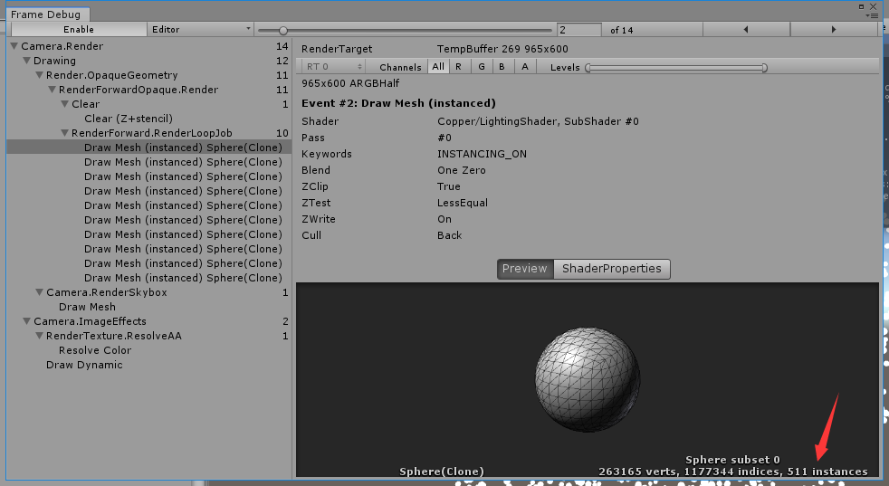

可以看到单次DrawCall的批次大小是**511**。这里Instancing Batch Size是通过**UNITY_MAX_INSTANCE_COUNT** 来定义的，Unity默认的大小是500。根据运行平台不同，这个最大批次数是变化的。也可以通过下面的指令进行修改：

```c#
#pragma instancing_options forcemaxcount:512
```

把最大批次数改为512，再次运行程序：

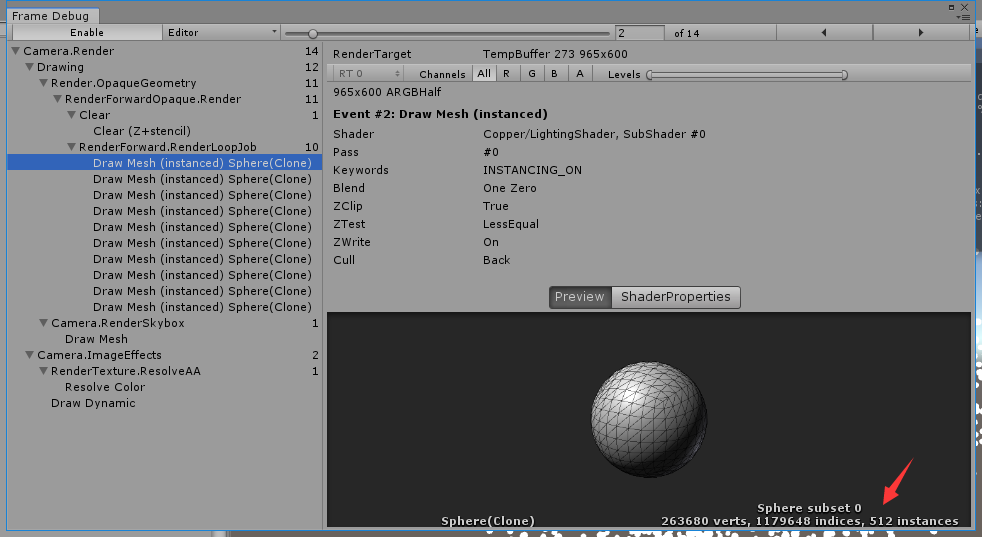

最大批次已经是512了，那么我们把最大批次修改为513会怎么样？

```
#pragma instancing_options forcemaxcount:513
```

运行后得到一个报错信息：


`常量缓冲区UnityInstancing_PerDraw0的大小为 4104个16字节的条目，超过了最大4096个条目。`

回到上面Instancing技术实现的说明：

> 将Per-Instance Data(世界矩阵，颜色等自定义变量)打包成Uniform Array，存储在Instance Constant Buffers中

Instance Data是存储在 **ConstantBuffers(D3D )/Uniform Buffer Object(OpenGL)**中的，那么也就是说一个批次能处理的Instance数量，取决于 **ConstantBuffers/UBO**的大小和**Instancing 属性**的多少。Windows下D3D的ConstantBuffer大小为**64KB**,那么基于上面的例子我们来算一下：

```
//上面的例子中在shader中将输入的结构体分配了Instance ID，之后Unity会在ConstantBuffers中存储两个矩阵：
// object-to-world : 世界坐标系下的矩阵 world-to-object：用于法线计算的矩阵
// 一个矩阵大小为 64byte
pSize = 64byte x 2 = 128byte
64KB = 64 x 1024 = 65536byte
max_count = 65536byte / 128byte = 512
所以批次最大Instance数为 512
```

OpenGl平台中UBO的大小通常只有ConstantBuffer大小的四分之一。

#### 2.4 

> http://gad.qq.com/article/detail/28456
>
> https://catlikecoding.com/unity/tutorials/rendering/part-19/
>
> https://learnopengl.com/Advanced-OpenGL/Instancing

